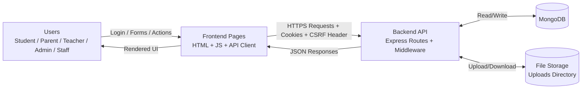
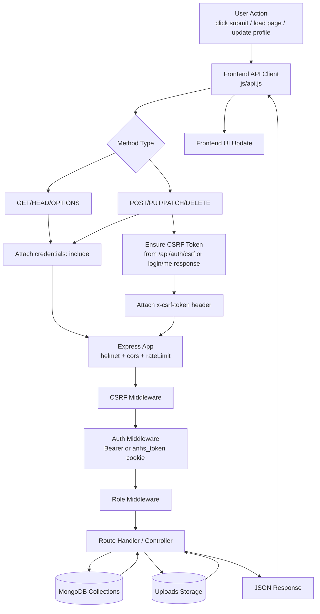
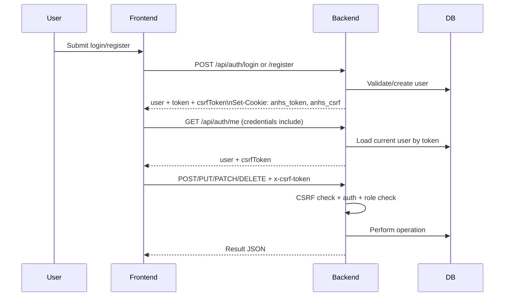

# ANHS EduPortal Data Flow Illustration

## 1) Context-Level Data Flow (High Level)

## 2) Backend-First Detailed Flow

## 3) Authentication + Session Flow

## 4) Core Data Stores (Current)
- `users` (includes role + UI preferences)
- `students`
- `parents`
- `teachers`
- `classes`
- `enrollments`
- `grades`
- `attendance`
- `assignments` and `assignmentsubmissions`
- `announcements`, `news`, `events`, `programs`
- `invites`, `parentlinks`, `parentmessages`
- uploads directory for files (metadata in DB, binary on storage)

## 5) Notes
- Business and profile data are backend/database driven.
- UI preferences are persisted in backend user preferences.
- Browser storage for business data is removed.
- CSRF is enforced for cookie-auth state-changing requests.
